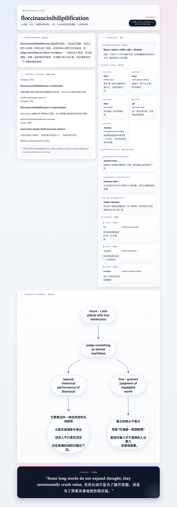

# lzc-explain-words

[English README](README.md)

这是一个用于英文单词深度掌握的 Codex skill，会生成具有 museum 风格的中英双语 HTML 词卡，内容包括：

- 核心语义骨架
- 词源与同族词
- 语感对比
- Mermaid 语义拓扑图
- 中英双语 epiphany 金句
- 可复现的极限压力测试产物

## 亮点

- 支持单词或多词输入。
- 对超长标题、超长音标做了自动换行保护，避免横向溢出。
- Mermaid 运行时已经内置到仓库 `assets/vendor/mermaid.min.js`，不再依赖 CDN。
- 每次渲染都会自动把 Mermaid 运行时复制到输出目录，离线打开也能正常显示。
- 仓库内已经包含极限压力测试输入、HTML 输出、桌面截图、移动端截图与摘要结果。

## 仓库结构

- `SKILL.md` —— skill 使用说明
- `assets/word_card.html` —— museum 风格 HTML 模板
- `assets/vendor/mermaid.min.js` —— 本地 Mermaid 运行时
- `scripts/render_word_cards.py` —— 单词/多词渲染脚本
- `scripts/run_extreme_stress_test.py` —— 可复现的渲染 + 截图压测脚本
- `examples/extreme-stress/input.json` —— 6 个极端长词输入集
- `examples/extreme-stress/results/` —— 最新 HTML、截图和 summary JSON
- `docs/extreme-stress-results.zh-CN.md` —— 压测结果说明

## 快速开始

从结构化 JSON 渲染词卡：

```bash
python3 scripts/render_word_cards.py \
  --input /path/to/words.json \
  --output-dir /path/to/output
```

渲染器除了写出 HTML，也会把 `mermaid.min.js` 一并复制到输出目录，因此本地查看时不需要联网。

## 极限压力测试

先安装移动端验证所需的 Playwright WebKit 浏览器：

```bash
npm exec --yes --package=playwright -- playwright install webkit
```

然后运行仓库内置的极限压测：

```bash
python3 scripts/run_extreme_stress_test.py
```

说明：

- 桌面端截图默认使用 Playwright Chromium + 本机 `chrome` channel。
- 如果本机没有 Chrome，可运行 `python3 scripts/run_extreme_stress_test.py --desktop-channel none`，退回 Playwright 自带 Chromium。
- 移动端截图使用 Playwright WebKit + `iPhone 14` 设备预设。

## 示例截图

### 桌面端



### 移动端


## 极限压测结果快照

当前仓库内置并已完成截图验证的 6 个极限词：

- `floccinaucinihilipilification`
- `honorificabilitudinitatibus`
- `psychoneuroendocrinological`
- `thyroparathyroidectomized`
- `otorhinolaryngological`
- `deinstitutionalization`

仓库内可直接查看的证据：

- 输入集：`examples/extreme-stress/input.json`
- HTML 输出：`examples/extreme-stress/results/html`
- 桌面截图：`examples/extreme-stress/results/screenshots/desktop`
- 移动端截图：`examples/extreme-stress/results/screenshots/mobile`
- 摘要 JSON：`examples/extreme-stress/results/summary.json`
- 文字说明：`docs/extreme-stress-results.zh-CN.md`

## 输入结构

基础必填字段仍然是：

- `word`
- `phonetic`
- `definition_deep`
- `etymology`
- `nuance_text`
- `example_sentence`
- `epiphany`
- `mermaid_code`

其中 `etymology` 继续兼容原来的原始 HTML，旧数据不用迁移也能渲染。

为了让“真实词块”和“整体义演化”更清楚地分开，渲染器现在额外支持这些可选结构化字段：

- `etymology_origin` —— 构词公式，例如 `flocci + nauci + nihili + pili + -fication`
- `etymology_formula` —— `etymology_origin` 的兼容别名
- `etymology_origin_note` —— 对整条来源路径的简短说明
- `etymology_chunks` —— 真实词块卡片数组；每项可含 `form`、`gloss`、`explanation`、可选 `role`
- `etymology_development` —— “整体义怎么长出来”的阶段数组；每项可含 `label`、`title`、`explanation`、可选 `kind`
- `etymology_cognates` —— 同族词卡片数组；每项可含 `term`、`note`、可选 `relation`

当这些结构化字段存在时，渲染器会优先使用它们，而不是直接渲染原始 `etymology` HTML。这样像真实词块、语义推进、修辞效果这几层信息就不会再混成一片。

如果结构化字段只覆盖了词源区的一部分，原来的 `etymology` HTML 不会被静默丢弃，而会保留在 `Additional Notes · 补充说明`。很短的补充说明默认展开，较长的说明默认折叠。

单个词条：

```json
{
  "word": "Excerpt",
  "phonetic": "ˈek.sɝːpt",
  "definition_deep": "<p>...</p>",
  "etymology": "<p>...</p>",
  "nuance_text": "<ul class=\"nuance-list\"><li class=\"nuance-item\">...</li></ul>",
  "example_sentence": "She quoted a brief excerpt.",
  "epiphany": "An excerpt is a chosen window. 摘录是被选择出来的一扇窗。",
  "mermaid_code": "graph TD\\nA[whole text] --> B[selected passage]"
}
```

带结构化词源字段的单词示例：

```json
{
  "word": "Floccinaucinihilipilification",
  "phonetic": "ˌflɒk.sɪ.nɔː.sɪˌnaɪ.hɪ.lɪˌpɪl.ɪ.fɪˈkeɪ.ʃən",
  "definition_deep": "<p>...</p>",
  "etymology": "<p>旧版兼容兜底 HTML。</p>",
  "etymology_origin": "flocci + nauci + nihili + pili + -fication",
  "etymology_origin_note": "多个表示“价值极低”的拉丁来源叠在一起，最后接名词后缀。",
  "etymology_chunks": [
    {
      "form": "flocci",
      "gloss": "of little value",
      "explanation": "先把价值往下压一层。",
      "role": "chunk"
    }
  ],
  "etymology_development": [
    {
      "label": "Step 1",
      "title": "semantic move",
      "explanation": "多个低价值词块连续堆叠，强化“轻视”的判定动作。",
      "kind": "meaning build-up"
    }
  ],
  "etymology_cognates": [
    {
      "term": "nil",
      "relation": "shared low-value idea",
      "note": "现代英语里更直接的“零、无价值”回声。"
    }
  ],
  "nuance_text": "<ul class=\"nuance-list\"><li class=\"nuance-item\">...</li></ul>",
  "example_sentence": "He treated the objection with floccinaucinihilipilification.",
  "epiphany": "A giant word can dramatize a tiny valuation. 冗长本身，也能参与轻视的语气。",
  "mermaid_code": "graph TD\\nA[low value] --> B[stacked learned forms] --> C[performative dismissal]"
}
```

多个词条：

```json
[
  {
    "word": "Excerpt",
    "phonetic": "ˈek.sɝːpt",
    "definition_deep": "<p>...</p>",
    "etymology": "<p>...</p>",
    "nuance_text": "<ul class=\"nuance-list\"><li class=\"nuance-item\">...</li></ul>",
    "example_sentence": "She quoted a brief excerpt.",
    "epiphany": "An excerpt is a chosen window. 摘录是被选择出来的一扇窗。",
    "mermaid_code": "graph TD\\nA[whole text] --> B[selected passage]"
  },
  {
    "word": "Serendipity",
    "phonetic": "ˌser.ənˈdɪp.ə.ti",
    "definition_deep": "<p>...</p>",
    "etymology": "<p>...</p>",
    "nuance_text": "<ul class=\"nuance-list\"><li class=\"nuance-item\">...</li></ul>",
    "example_sentence": "Their meeting was pure serendipity.",
    "epiphany": "Serendipity is chance meeting a prepared soul. 机缘是偶然遇见了有准备的灵魂。",
    "mermaid_code": "graph TD\\nA[searching] --> B[finding]"
  }
]
```

## 输出

- 单词输入 → 一个 `word_card_<slug>.html`
- 多词输入 → 多个 HTML 词卡 + `word_cards_index.html`

## 许可证

本仓库使用 `GPL-2.0-only` 许可，完整文本见 `LICENSE`。
