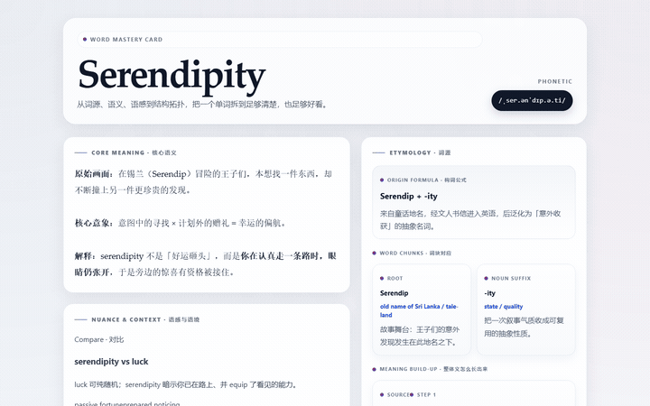

<sub>🌐 <a href="README.md">English</a> · <b>中文</b></sub>

<div align="center">

# lzc-explain-words

> *「词典告诉你一个词是什么意思；这个 Skill 让你看见，它的意义是怎么长出来的。」*

[](SKILL.md)
[](#你会得到什么)
[](#运行要求)
[](LICENSE)

**输入一个英文词，或者一整组词；得到可收藏的双语 HTML 词卡，里面有词源、语感、语义拓扑和一句真正记得住的话。**

[先看效果](#看看真实效果) · [立即安装](#快速开始) · [复制触发词](#怎么触发) · [复现验证](#复现与验证) · [安全边界](#默认离线)

</div>

---



<sub>真实回放来自 [`examples/showcase/input.json`](examples/showcase/input.json)，由 [`scripts/record_showcase.py`](scripts/record_showcase.py) 录制。</sub>

---

## 它解决什么问题

查到 *serendipity* 的中文意思只要几秒。难的是过几天以后，你还记不记得它为什么有这种语感。

普通释义常常漏掉真正帮助记忆的东西：这个词最初的画面、构词部分如何配合、它和近义词到底差在哪儿，以及哪一句话能把整层意义钉进脑海。`lzc-explain-words` 把这些内容组织成一件可以保存、重开和比较的视觉作品。

它首先是 Agent Skill，其次才是渲染器：Agent 负责完成语言解构，仓库里的脚本负责把结果变成离线词卡，而不是让答案继续埋在聊天记录里。

---

## 你会得到什么

| 层次 | 词卡会呈现什么 |
| --- | --- |
| 核心语义骨架 | 释义背后的原始画面与概念公式 |
| 词源地图 | 把真实词块、整体义演化和同族词分开呈现 |
| 语感对比 | 解释这个词与邻近词为什么“感觉不一样” |
| 语义拓扑 | 用 Mermaid 串起来源、核心动作与现代用法 |
| 双语 Epiphany | 用一句中英金句收住整个词的灵魂 |
| 离线产物 | 不依赖 Mermaid CDN、可本地收藏的 HTML 词卡 |

一个词生成一张卡；多个词生成多张卡，并额外生成本地索引页。

---

## 看看真实效果

只需对 Agent 说一句自然语言：

```text
深度解释 Serendipity，并生成一张 HTML 词卡。
```

Skill 会整理结构化内容，渲染 `word_card_serendipity.html`，把本地 Mermaid 运行时复制到旁边，最后返回词卡路径与双语 Epiphany。

上面的 GIF 使用仓库内真实输入生成，不是手工摆拍。任何时候都可以重新录制：

```bash
python scripts/record_showcase.py
```

---

## 快速开始

一行安装：

```bash
npx skills add Kiasma1/lzc-explain-words
```

装完后直接对 Agent 说：

```text
讲透 incubate 这个词，并生成词卡。
```

这条安装命令已经对公网 GitHub 仓库做过真实回放；安装器会识别支持的 Agent 环境，并安装仓库根目录的 [`SKILL.md`](SKILL.md)。

### 手动安装

如果你想先检查仓库，或者自行建立链接：

```bash
git clone --depth 1 https://github.com/Kiasma1/lzc-explain-words.git
```

把克隆目录复制或链接到运行时的 skills 目录即可。`--depth 1` 会避开 Git 历史中遗留的旧截图；只有需要完整贡献历史时才去掉它。

---

## 怎么触发

安装后可以直接这样说：

- `深度解释这个词：Serendipity。`
- `生成词卡 incubate。`
- `把 excerpt、lucid、serendipity 做成 HTML 词卡。`
- `讲透 resilience 这个单词。`
- `用语感对比讲清 ingenious 和 ingenuous。`
- `词源解构 floccinaucinihilipilification，并生成词卡。`

纯翻译、刷词表、只查音标，以及明确不需要 HTML 产物的随口解释，不属于这个 Skill 的触发范围。

---

## 直接渲染结构化数据

Agent 工作流会先写出结构化 JSON，再调用渲染器。你也可以直接使用渲染器：

```bash
python scripts/render_word_cards.py \
  --input examples/showcase/input.json \
  --output-dir ./word-cards
```

如果系统只提供 `python3` 命令，请把上面的 `python` 替换为 `python3`。

基础必填字段：

```text
word · phonetic · definition_deep · etymology · nuance_text
example_sentence · epiphany · mermaid_code
```

这些可选字段会把真实词块和后来的整体义演化分开：

| 字段 | 用途 |
| --- | --- |
| `etymology_origin` | 简洁的来源或构词公式 |
| `etymology_origin_note` | 对整体来源路径的说明 |
| `etymology_chunks` | 真实词块或语素卡片 |
| `etymology_development` | 展示整体意义如何逐步形成 |
| `etymology_cognates` | 同族词及其关系 |

原始 `etymology` HTML 仍然兼容旧数据。完整真实输入见 [`examples/showcase/input.json`](examples/showcase/input.json)。

---

## 它和普通解释有什么不同

| 维度 | 常见聊天解释 | `lzc-explain-words` |
| --- | --- | --- |
| 最终形态 | 一段容易被冲走的消息 | 可反复打开的离线 HTML 作品 |
| 词源 | 常是一整段文字 | 词块、意义演化和同族词分层呈现 |
| 语感 | 罗列近义词 | 聚焦邻近词在真实使用中的感觉差异 |
| 语义模型 | 只有文字 | 解释旁边带可视化 Mermaid 拓扑 |
| 多词处理 | 容易漏词或打乱顺序 | 按顺序生成词卡和索引；失败必须明说 |
| 验证方式 | 依赖当次 Agent 发挥 | 有测试 prompt、单测、演示录制器和压力管线 |

---

## 默认离线

- 渲染不需要 API key，也不会发起网络请求。
- Mermaid 正本位于 [`assets/vendor/mermaid.min.js`](assets/vendor/mermaid.min.js)，每次输出都会复制一份到词卡旁边。
- Skill 不得把 API key、私人路径或真实账号写进词卡。
- 词源不确定时必须明确标注，不得编造看起来权威的拉丁或希腊词根。
- 缺少必填字段时会明确失败，不会静默生成一张“看起来没问题”的残缺词卡。
- 截图工具不可用时仍然交付 HTML，并说明跳过了视觉检查。

语言内容由当前 Agent 生成；在高准确性场景中，请进一步核验词源断言。

---

## 复现与验证

运行轻量回归测试：

```bash
python -m unittest discover -s tests -v
```

用桌面 Chromium 和 iPhone 14 WebKit 预设运行 6 词极限版式压测：

```bash
npm exec --yes --package=playwright -- playwright install webkit
python scripts/run_extreme_stress_test.py
```

最近一次本地真实回放生成了 6 张 HTML 词卡、6 张 1440 像素桌面截图、6 张 1170 像素移动截图；6 张卡全部引用本地 Mermaid，远程脚本引用为 0。机器可读摘要写入 `examples/extreme-stress/results/summary.json`。

生成的 HTML、截图和摘要由 Git 忽略，以保持当前检出的 Skill 轻量。仓库保留输入与验证约定：

- [`examples/extreme-stress/input.json`](examples/extreme-stress/input.json)
- [`docs/extreme-stress-results.zh-CN.md`](docs/extreme-stress-results.zh-CN.md)
- [`tests/test_run_extreme_stress_test.py`](tests/test_run_extreme_stress_test.py)

运行 `python scripts/record_showcase.py` 可以重录 README 动画；录制器还需要已安装 Chrome，并能从 `PATH` 找到 npm 与 `ffmpeg`。

---

## 项目结构

```text
SKILL.md                              Agent 工作流与硬边界
assets/word_card.html                 博物馆风格 HTML 模板
assets/vendor/mermaid.min.js          离线 Mermaid 运行时正本
scripts/render_word_cards.py          JSON → HTML 渲染器
scripts/record_showcase.py             可复现的 README GIF 录制器
scripts/run_extreme_stress_test.py     桌面与移动端压力测试管线
examples/showcase/                     日常词输入与展示 GIF
examples/extreme-stress/input.json     6 个极限版式输入
docs/                                  压测复现说明
tests/                                 跨平台回归测试
test-prompts.json                      标准 Agent 验收 prompt
```

---

## 运行要求

- 支持仓库型 Agent Skills 的运行时，例如 Claude Code、Codex 或其他兼容环境。
- 直接渲染和仓库测试需要 Python 3.10+。
- 打开生成词卡不需要网络，也不需要 API key。
- 可选：截图需要 npm + Playwright；重录 GIF 需要已安装 Chrome，并能从 `PATH` 找到 `ffmpeg`。

---

## 致谢

离线语义图使用 [Mermaid](https://mermaid.js.org/)；跨浏览器版式回放使用 [Playwright](https://playwright.dev/)。

## 许可证

本仓库使用 [`GPL-2.0-only`](LICENSE) 许可。

---

<div align="center">

*输入一句话，真正理解一个词，留下一张可以收藏的卡。*

</div>
