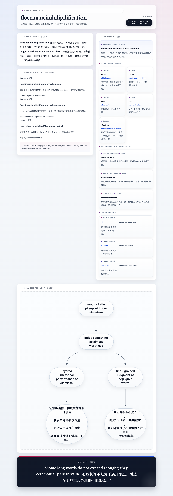

# Extreme Stress Test Results

This repository ships an offline Mermaid runtime and a reproducible screenshot pipeline.
The latest extreme stress run was generated from `examples/extreme-stress/input.json` with:

```bash
python3 scripts/run_extreme_stress_test.py
```

## What was verified

- Long titles and long phonetics still wrap without horizontal overflow.
- Mermaid renders from the vendored `assets/vendor/mermaid.min.js` copy, not a CDN.
- Desktop screenshots use Playwright Chromium with the `chrome` channel.
- Mobile screenshots use Playwright WebKit with the `iPhone 14` device preset.

## Latest run summary

Sizes below match `examples/extreme-stress/results/summary.json` (source of truth).

| Word | Desktop | Mobile |
| --- | --- | --- |
| `deinstitutionalization` | `1440×3792` | `1170×13251` |
| `floccinaucinihilipilification` | `1440×4110` | `1170×14307` |
| `honorificabilitudinitatibus` | `1440×4073` | `1170×14013` |
| `otorhinolaryngological` | `1440×3617` | `1170×13086` |
| `psychoneuroendocrinological` | `1440×3683` | `1170×13944` |
| `thyroparathyroidectomized` | `1440×3683` | `1170×13740` |

Desktop channel in summary: `chrome`. Mobile device: `iPhone 14`.

## Example screenshots

### Desktop



### Mobile


## Artifacts

- Input: `examples/extreme-stress/input.json`
- HTML: `examples/extreme-stress/results/html`
- Screenshots: `examples/extreme-stress/results/screenshots`
- Machine-readable summary: `examples/extreme-stress/results/summary.json`
